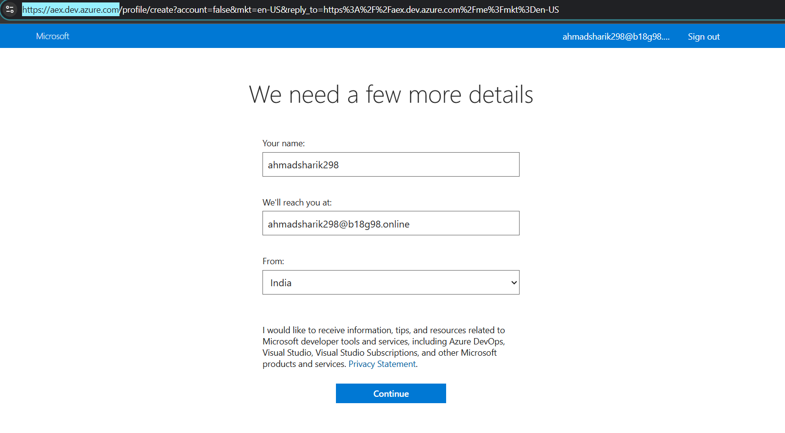
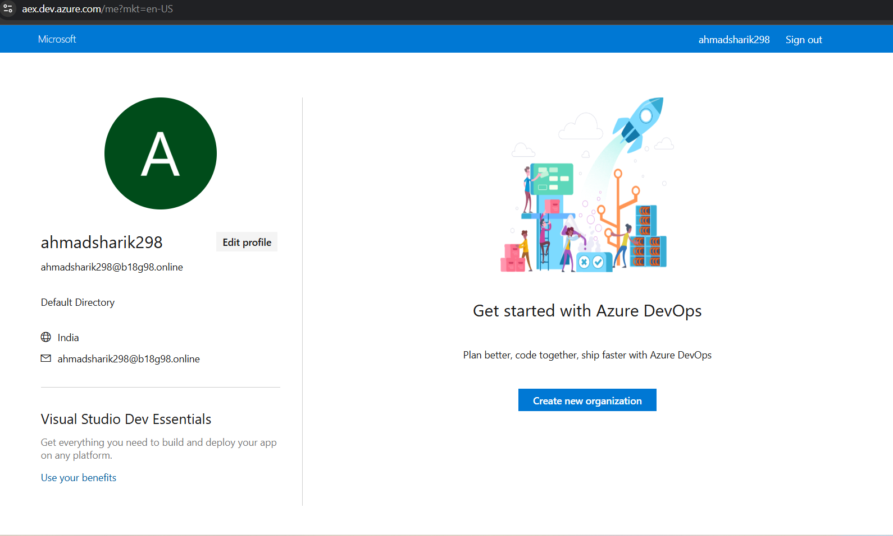
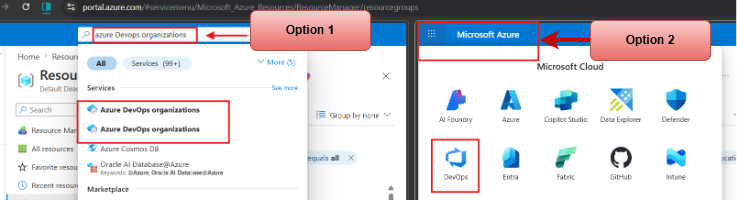

# 📘 Introduction to DevOps & Azure DevOps

Welcome to the first step of your Azure DevOps journey 🚀

Imagine you are building an application.

You write code, test it, and then deploy it so users can use it.
But what if everything becomes slow, manual, and error-prone?

👉 This is where **DevOps** comes into the picture.

---

## 🔹 What is DevOps?

DevOps is a combination of two words:

* **Development (Dev)** → Writing application code
* **Operations (Ops)** → Deploying and managing applications

👉 DevOps is a **culture and set of practices** that helps teams work together and deliver software faster and more reliably.

---

## ❌ Traditional Way (Before DevOps)

Earlier, Development and Operations teams worked separately:

* Developers wrote code
* Operations deployed it

👉 This caused problems like:

* Slow releases
* More errors
* Communication gaps

---

## ✅ DevOps Approach

DevOps solves these problems by:

✔ Improving collaboration
✔ Automating processes
✔ Delivering software faster

👉 Goal: **Faster + Reliable + Continuous delivery**

---

## 🔁 DevOps Lifecycle

DevOps follows a continuous cycle:

1. Plan
2. Develop
3. Build
4. Test
5. Release
6. Deploy
7. Monitor

👉 This cycle repeats continuously.

---

## 🔹 What is Azure DevOps?

Azure DevOps is a set of tools provided by Microsoft to implement DevOps practices.

👉 It helps teams to:

* Manage code
* Build applications
* Test software
* Deploy applications

All in one platform.

---

## 🧰 Key Features of Azure DevOps

* **Azure Repos** → Source code management (Git)
* **Azure Pipelines** → CI/CD automation
* **Azure Boards** → Work tracking
* **Azure Artifacts** → Package management
* **Azure Test Plans** → Testing tools

---

## 🌍 Real-World Example

Imagine you are building a web application:

1. Developer pushes code → Azure Repos
2. Pipeline runs → Build & Test
3. Application deploys automatically
4. Monitoring tracks performance

👉 This entire process is automated using Azure DevOps.

---

## 🌐 How to Access Azure DevOps

You can access Azure DevOps in multiple ways:

---

### 🔹 Method 1: Direct Website

Go to: https://aex.dev.azure.com/

* Sign in with your Microsoft account
* Create or select your organization

---

## 🖼️ Azure DevOps Login Page

---

## 🖼️ Azure DevOps After Login Page

---

### Method 2: Through Azure Portal

1. Open Azure Portal
2. Search for "Azure DevOps organizations"

OR

1. Open Azure Portal
2. Click the Microsoft Azure menu
3. Select DevOps
4. Choose your organization

---

## 💰 Is Azure DevOps Free?

Azure DevOps provides a **free tier**:

* Up to 5 users
* Unlimited private repositories
* Free CI/CD pipelines (limited usage)

👉 You can learn and build projects without any cost.

---

## ⚠️ Important Note

* **Azure DevOps** → DevOps tools (Free tier available)
* **Azure** → Cloud resources (May cost after trial)

---

## 💡 Key Takeaways

* DevOps = Culture + Automation
* Azure DevOps = Tool to implement DevOps
* CI/CD = Core of DevOps

---

## 🚀 What’s Next?

Now that you understand the basics, move to:

👉 **02-azure-devops-services**

Let’s explore each service in detail 🔥

---