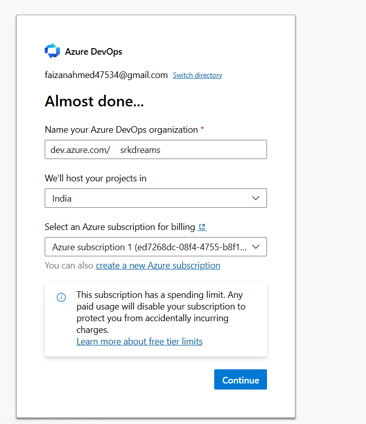
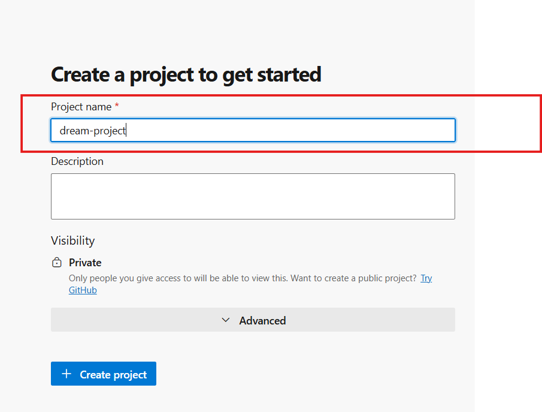

# 📦 Azure Repos


---

Azure Repos is a service in Azure DevOps that helps you manage your source code using version control systems like Git.

---

## 🔹 What is Azure Repos?

Azure Repos provides Git repositories where you can store, track, and manage your code.

**👉 It allows developers to**:

- Store source code
- Track changes
- Collaborate with team members
- Maintain version history

---

### 🧠 What is Version Control?

Version control is a system that helps you:

- Track changes in code
- Restore previous versions
- Work with multiple developers without conflicts

---

### 🔥 Why Use Azure Repos?

Without version control:

- Code gets lost ❌
- No history ❌
- Team conflicts ❌

With Azure Repos:

- ✔ Full code history
- ✔ Safe collaboration
- ✔ Branching & merging
- ✔ Easy rollback

---

### 🔹 Types of Repositories

Azure Repos supports:

**1️⃣ Git (Distributed)**

- Most widely used
- Each developer has a full copy of the repository

**2️⃣ TFVC (Centralized)**

- Older version control system
- Less commonly used

👉 In this guide, we will use Git.

### 🔁 Basic Git Workflow
```bash
Developer → Write Code → Commit → Push → Repository
```

### 🌍 Real-World Example

Imagine a team working on a web application:

- Developer writes code
- Commits changes locally
- Pushes code to Azure Repos
- Team members pull latest updates

**👉 This keeps everyone in sync.**

---

# 🛠️ How to Create a Repository in Azure DevOps (Beginner Friendly)

In this section, **we will create a repository step-by-step**.

Even if you are a beginner, you will understand everything easily.

---

## 🔹 Step 1: Open Azure DevOps

- 👉 Go to: https://aex.dev.azure.com/

- Sign in with your Microsoft account 
- Create a new organization (if you are a new user)  
- Or select an existing organization  

**screenshot of creating organization**



**srkdreams is a oraganization name**

---

### ❓ What is an Organization?

An organization in Azure DevOps is like a container or workspace where all your projects are stored.

**👉 It helps you**:

- Manage multiple projects
- Control access (who can see or edit)
- Organize your work properly

---

### 💡 Simple Example

Imagine a company called ABC Tech:

- Organization → ABC Tech
- Projects → Website, Mobile App, API

**👉 So**:

- Organization = Company
- Project = Individual application

---

## 🔹 Step 2: Create a New Project

- Click New Project
- Enter details:
- Project Name (e.g., devops-demo)
- Visibility → Private (recommended)
- Click Create

**screenshot of making project**



---

### ❓ Why Keep Project Private?

**👉 Private project means**:

- Only you (or selected users) can access it
- Your code is secure
- No one else can see your work

---

### 💡 When to Use Public?

- When you want to share code openly (like GitHub projects)
- For open-source contributions

**👉 For learning and practice → Always use Private ✅**

---

## 🔹 Step 3: Go to Repos

- Open your project
- Click Repos from the left menu

**👉 This is where your code will be stored.**

---

## 🔹 Step 4: Initialize Repository

- Select Initialize with README

**👉 This will**:

- Create your repository
- Add a default README file
- Make your first commit automatically

---

### ❓ What is a Commit?

- A commit means saving your changes in version control.

**👉 Think of it like**:

-“Saving your work with a message”

---

## 🔹 Step 5: Clone Repository

- Click Clone and copy the URL.

Then run:

**git clone <repo-url>**

- 👉 This downloads the repository to your local system.

---

## 🔹 Step 6: Push Code

- git add .
- git commit -m "initial commit"
- git push

**👉 This uploads your local code to Azure Repos.**

---

### 🔁 Complete Workflow

**Create Repo → Clone → Add Code → Commit → Push → Azure Repos**

---

## 🌍 Real-World Example

**Imagine you are working on a web application**:

- You create a project in Azure DevOps
- You create a repository
- You clone it to your system
- You write code
- You push it to Azure Repos

**👉 Now your code is:**

- Safe
- Version controlled
- Accessible to your team

---


## 💡 Key Takeaways

- Organization = Workspace (like company)
- Project = Application
- Repo = Code storage
- Commit = Save changes
- Push = Upload code

---