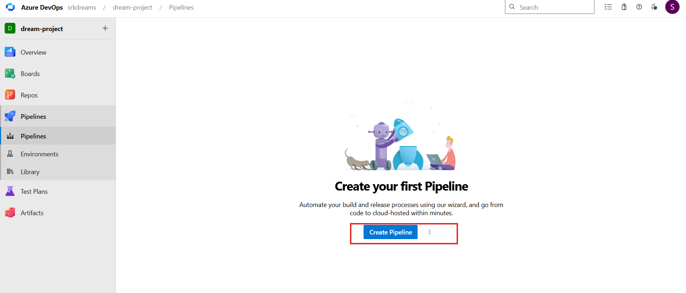
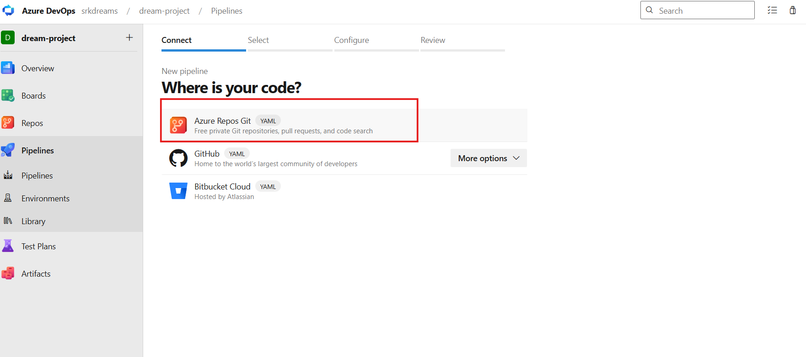
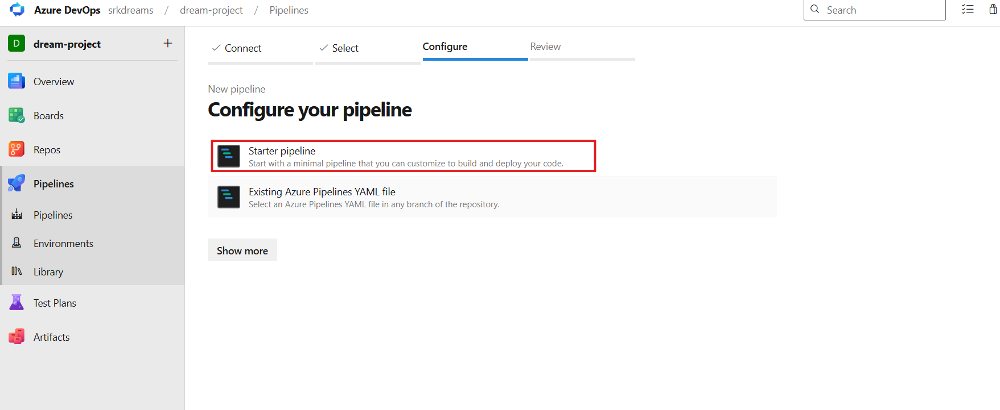
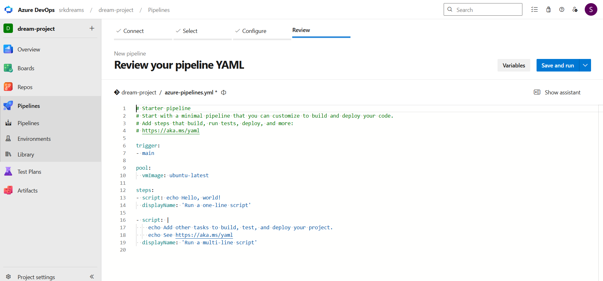
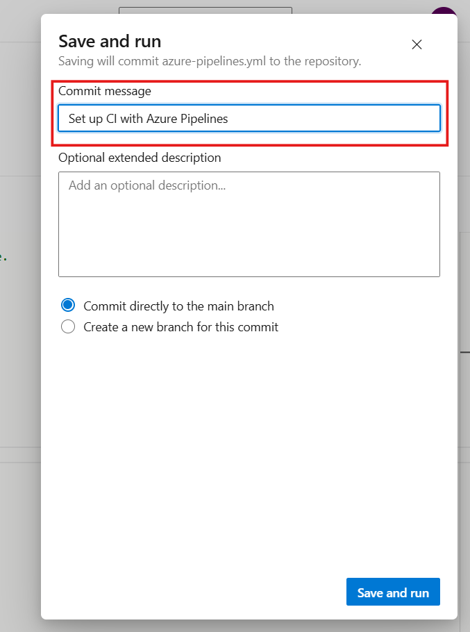
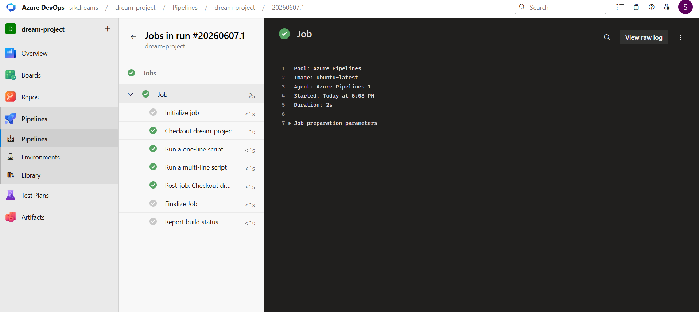

# ⚙️ Azure Pipelines (CI/CD Automation)

---

Welcome to the Azure Pipelines section 🚀

Now that you understand Azure Repos and Git workflow, let’s move to the heart of DevOps — Automation.

---

### 🧠 Think Like This (Simple Story)

Imagine you are a developer 👨‍💻

You:

- Write code
- Test it
- Deploy it

---

👉 Now imagine doing this manually every time…

- Build manually ❌
- Test manually ❌
- Deploy manually ❌

---

👉 This is slow, boring, and error-prone.

## 🔥 So what’s the solution?

**👉 Azure Pipelines**

---

# 🔹 What is Azure Pipelines?

Azure Pipelines is a tool that automates your entire workflow.

**👉 It automatically**:

- Builds your application
- Runs tests
- Deploys your code

**👉 Without manual effort**.

---

### 💡 In One Line

**👉 Azure Pipelines is a CI/CD tool used to automate build, test, and deployment processes.**

---

### 🔁 What is CI/CD?

Let’s break it simply 👇

**🔹 CI (Continuous Integration)**

👉 Whenever a developer pushes code:

- Code builds automatically
- Tests run automatically

👉 This ensures code is always working.

---

**🔹 CD (Continuous Deployment)**

👉 After successful build & test:

- Code gets deployed automatically

👉 No manual deployment needed.

---

### 🔁 Complete Flow

**Developer → Push Code → Pipeline Runs → Build → Test → Deploy**

👉 This whole process is automated.

---

## 🎯 Why Azure Pipelines?

### ❌ Without Pipelines

- Manual work
- Slow delivery
- More mistakes

---

### ✅ With Pipelines

- Automation
- Faster releases
- Consistent results
- Better quality

---

## ⚙️ Types of Pipelines

### 🔹 1. Classic Pipeline (UI Based)

👉 You create pipeline using UI

- Easy to start
- Good for beginners
- Not used much in real projects

---

#### 🔹 2. YAML Pipeline (Recommended 🔥)

👉 Pipeline is written as code

- Stored in repository
- Version controlled
- Used in real-world DevOps

---

### 🔗 How It Connects with Azure Repos

**Code Push → Azure Repos → Azure Pipeline → Build & Deploy**

👉 Pipelines work on top of your repository.

---

# 🚀 How to Create a Pipeline (Step-by-Step)

Open your Azure DevOps project and follow these steps:

### Step 1: Go to the Pipelines Section

- Click on Pipelines in the left menu bar of your project.

- If you haven't created a pipeline yet, you will see a blue "Create Pipeline" button in the middle of the screen.

---

### Step 2: Connect - Where is your code?

- Clicking "Create Pipeline" opens a new page. Azure will ask where your code is hosted.

- You will see options like GitHub, Bitbucket, and Azure Repos. Since we learned about "Azure Repos" in the previous module, click on Azure Repos Git.

---

### Step 3: Configure - Select a Template

- After selecting the repository, Azure DevOps will suggest some templates based on your code (like Node.js, Python, Docker).

- Since we are focusing on the basics right now, select "Starter pipeline" from the list.

---

### Step 4: Review - Understand the YAML File

- A text editor will open showing the code for the azure-pipelines.yml file. This file is the heart of the pipeline. It mainly has 3 parts that you should explain in your README:

- trigger: Here you will see - main. This means that whenever someone pushes new code to the main branch, this pipeline will run automatically.

- pool: Here you will see vmImage: ubuntu-latest. This means Microsoft is providing us a free Ubuntu Linux computer (agent) to run this pipeline.

- steps: Here you will see basic commands like echo 'Hello, world!'. These are the commands that will run on that Ubuntu computer.

---

### Step 5: Save and Run

- You will find a blue "Save and run" button at the top right corner of the page. Click on it.

- A small pop-up will appear asking for a "Commit message" (e.g., "Set up CI with Azure Pipelines"). Click on "Save and run" again.

---

### Step 6: See the Pipeline Magic (Execution)

- You will now be taken to a new page where the "Job" is running. You will see a rotating icon.

- Click on the word "Job" below it.

- You will see a black terminal console. Here you will see the pipeline running all your steps one by one. Every successful step will get a green checkmark (✅).

---

## 🌍 Real-World Example

Imagine a real project:

- Developer pushes code to Azure Repos
- Pipeline triggers automatically
- Application builds
- Tests run
- Code gets deployed

👉 Everything happens automatically 🔥

---

### ⚠️ Important Terms (Must Know)

- Trigger → Starts the pipeline
- Agent → Machine that runs pipeline
- Job → Set of tasks
- Step → Individual command

---

**💡 Best Practices**

- ✔ Always use YAML pipelines
- ✔ Keep pipeline simple
- ✔ Use stages (Build → Test → Deploy)
- ✔ Store secrets securely
- ✔ Monitor pipeline runs

---

## 🎯 Interview Questions

### ❓ What is Azure Pipelines?

- 👉 A CI/CD tool used to automate build, test, and deployment.

---

### ❓ What triggers a pipeline?

- 👉 Code push, pull request, or manual trigger.

---

### ❓ What is YAML pipeline?

- 👉 A pipeline defined as code for automation and version control.

---

### ❓ What is an agent?

-👉 A machine that executes pipeline tasks.

---

### 💥 Final Understanding

👉 Think like this:

**Azure Repos → Stores code**
**Azure Pipelines → Runs automation**

---
