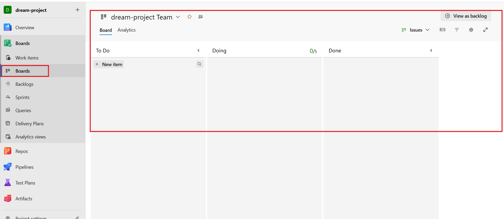
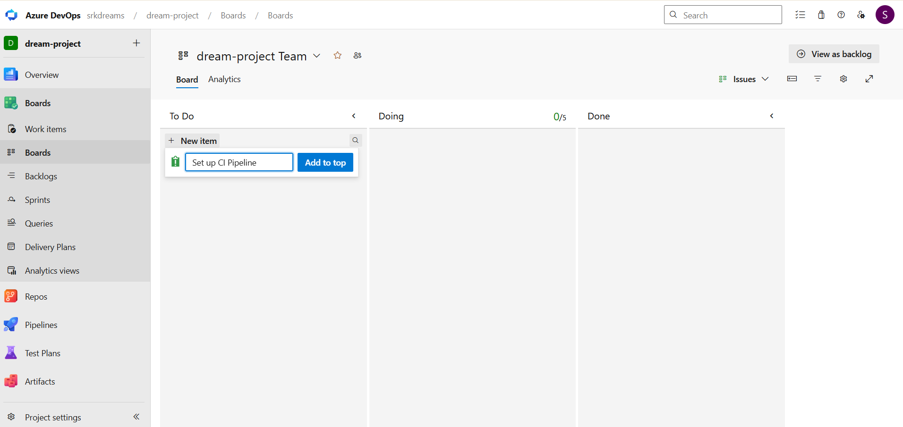
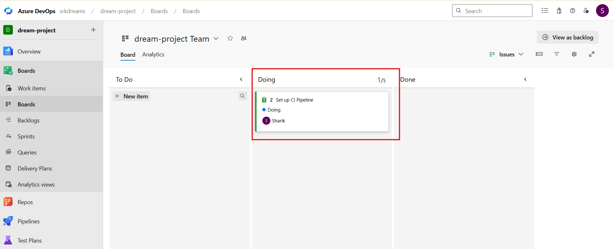
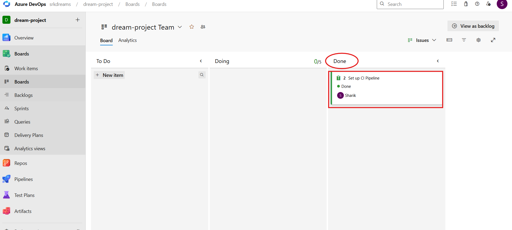

# 📋 Azure Boards (Work Management)

---

Welcome to the **Azure Boards** section 🚀

Till now you have learned:

**Azure Repos → Code storage**
**Azure Pipelines → Automation**

👉 Now let’s understand:

**How teams plan, manage, and track work**❗

---

# 🧠 Think Like This (Simple Story)

Imagine you are working in a company 👨‍💻

You have tasks like:

- Build login page
- Fix bugs
- Add new features

👉 How will you track all this?

- Excel sheet? ❌
- WhatsApp messages? ❌

👉 This becomes messy very quickly

---

# 🔥 Solution → Azure Boards

---

## 🔹 What is Azure Boards?

Azure Boards is a tool that helps you:

- Plan work
- Track tasks
- Manage progress

**👉 It gives a structured and organized way to manage projects.**

---

### 💡 In One Line (Interview Ready)

**👉 Azure Boards is a work tracking tool used to manage tasks, bugs, and project progress in DevOps.**

---

## 🎯 Why Use Azure Boards?

**❌ Without Boards**

- No task tracking
- Team confusion
- Missed deadlines

**✅ With Boards**

- Clear task management
- Better collaboration
- Organized workflow
- Full visibility

---

# 🧩 Core Concepts (Deep Understanding)

---

## 🔹 Work Item (Task / Bug / User Story)

**👉 Work Item = smallest unit of work**

- Task → Small work
- Bug → Fix issue
- User Story → Feature

---

## 🔹 Board (Visual Tracker)

**👉 Board shows task progress visually**

- To Do → In Progress → Done

---

## 🔹 Sprint (Time Cycle)

**👉 Fixed time (1–2 weeks) to complete work**

---

## 🔹 Backlog (Task List)

**👉 All pending work (project to-do list)**

---

## 🔁 Complete Workflow

**Backlog → Sprint → Work Item → Board Tracking**

---

### 🛠️ When Do We Use Azure Boards?

👉 At the start of a project

**Requirement → Planning → Task Creation → Tracking**

---

## Hands-On: Setting Up Your First Kanban Board

### 🔹 What is a Kanban Board?

👉 A Kanban board is a visual way to track work using columns like:

**To Do → In Progress → Done**

👉 The name `Kanban` comes from a Japanese word meaning `visual signal` or `card`.

👉 It is called Kanban because tasks are shown as cards and moved across stages.

---

### Step 1: Go to the Boards Section

* Click on **Boards** in the left menu bar, and then select the **Boards** option from the inner menu.
* You will see a visual board with different columns (like *To Do, Doing, Done* or *New, Active, Closed*).

---

### Step 2: Create a New Work Item (Card)

* At the top of the first column (like 'New' or 'To Do'), click on **+ New Item**.
* Type the name of your task in the text box, for example: *"Set up CI Pipeline"* or *"Design Login Page"*, and press **Enter**.

---

### Step 3: Assign the Task (Give Responsibility)

* Double-click on the card you just created to open its details.
* Right below the title, look for a profile icon that says **"No one selected"**. Click on it and select your name from the dropdown list.
* You can also add a description of what needs to be done. 
* Don't forget to click the blue **Save & Close** button at the top right.

---

### Step 4: The Kanban Magic (Drag and Drop)

* You will now be back on your main Board. 
* As a developer, when you actually start working on this task, you need to show your progress.
* Click and hold your card, drag it out of the 'To Do' column, and drop it into the **Doing / Active** column.

---

### Step 5: Completing the Task

* Once your work is fully finished and tested, pick up that card one last time and drag it into the final **Done / Closed** column.
* Congratulations! You have successfully tracked an Agile task from start to finish.

---

### 🌍 Real DevOps Flow

* Code → Azure Repos  
* Tasks → Azure Boards  
* Automation → Pipelines

---

### 💡 Best Practices

* ✔ Break tasks into small pieces
* ✔ Assign clearly
* ✔ Update status regularly
* ✔ Use sprints
* ✔ Link commits with tasks

---

### 🎯 Interview Questions

**❓ What is Azure Boards?**

* 👉 Work tracking tool for managing tasks and progress

---

**❓ What is a work item?**

* 👉 A unit of work like task, bug, or user story

---

**❓ What is a sprint?**

* 👉 Fixed time period to complete tasks

---

**❓ What is backlog?**

* 👉 List of all pending work

---

**❓ Why use Azure Boards?**

* 👉 To organize and track work efficiently

---

### 💥 Final Understanding

👉 Think like this:

* Azure Repos → Code
* Azure Pipelines → Automation
* Azure Boards → Work Management

---