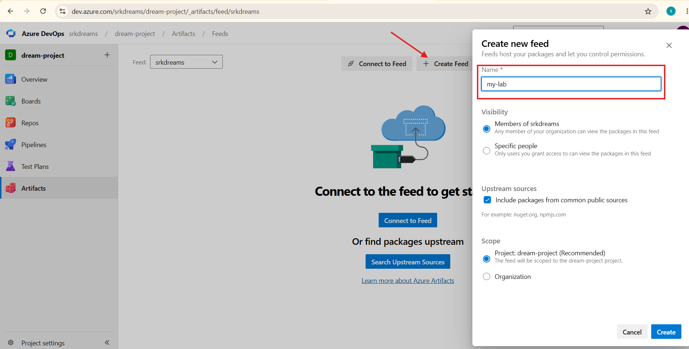
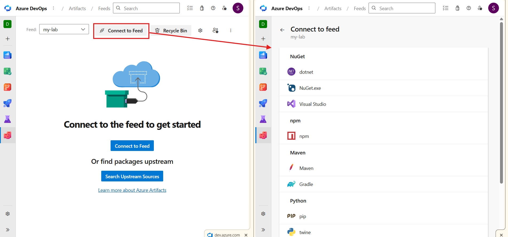

# 📦 Azure Artifacts (Package Management)


---

Welcome to the `Azure Artifacts section` 🚀

**Till now you have learned**:

* Azure Repos → Code storage
* Azure Pipelines → Automation
* Azure Boards → Work tracking

---


**👉 Now let’s understand**:

`How to manage project dependencies and packages `❗

---


# 🧠 Think Like This (Simple Story)

Imagine you are building an application 👨‍💻

**Your project needs**:

* Libraries
* Packages
* Dependencies

**👉 Example**:

* React app needs npm packages
* Java app needs Maven dependencies

---

**👉 Question**:

❓ Where will you store these packages?

* Local system? ❌
* Random downloads? ❌

**👉 Not reliable**.

---

# 🔥 Solution → Azure Artifacts

---

## 🔹 What is Azure Artifacts?

**Azure Artifacts is a service that helps you**:

* Store packages
* Manage dependencies
* Share packages across teams

👉 It acts like a `private package storage (registry)`

---


### 💡 In One Line (Interview Ready)

**👉 Azure Artifacts is a package management service used to store and manage project dependencies in DevOps**.

---

### 🎯 Why Use Azure Artifacts?

**❌ Without Artifacts**

* Dependency issues
* Version conflicts
* No central storage

---

**✅ With Artifacts**

* Centralized package storage
* Version control
* Secure sharing
* Easy integration with pipelines

---

# 🧩 Key Concepts

---
## 🔹 Package

👉 A reusable piece of code

**Examples**:

* npm package
* Maven library
* Python package

---

## 🔹 Feed

👉 Feed is a `container that stores packages`

**👉 Think like**:

* Feed = Folder of packages

---

## 🔹 Versioning

**👉 Each package has versions**:

* v1.0 → v1.1 → v2.0

**👉 Helps manage updates safely**

---

# 🚀 How to Use Azure Artifacts (Step-by-Step)

---

## 🔹 Step 1: Open Azure DevOps

* Go to https://aex.dev.azure.com/
* Open your project

---

## Step 2 : Create a Feed

* Go to your Azure DevOps Portal (dev.azure.com) and open your project.

* Click on Artifacts in the left sidebar.

* Click the + Create Feed button at the top.

* A side window will open. Fill in the following details:

`Name`: Give your feed a name (e.g., my-custom-packages).

`Visibility`: Choose whether you want it visible to the entire Organization or just within this Project.

`Upstream sources`: Leave this checked by default (this allows you to route public packages, like those from npmjs.com, through your feed).

* Click Create. Your feed is now ready!

**Screenshot**



---

## Step 3: Connect to the Feed

* Once the feed is created, click on the `Connect to feed` option at the top.

* Select the technology you are working with (such as npm, NuGet, Pip, etc.).

* Azure DevOps will provide you with the exact steps and commands (like npm login or nuget sources add) needed to connect your local terminal or pipeline to this feed.

**Screenshot**



---

## 🌍 Real-World Example

**Project: Web Application**

`👉 Developer`:

* Creates package
* Pushes to Azure Artifacts

`👉 Pipeline`:

* Pulls package
* Builds application

`👉 Everything stays controlled and secure`

---

## 💡 Best Practices

* ✔ Use private feeds
* ✔ Maintain versioning
* ✔ Avoid hardcoding dependencies
* ✔ Integrate with pipelines

---

## 🎯 Interview Questions

### ❓ What is Azure Artifacts?

`👉 Package management service`

---

### ❓ What is a feed?

`👉 A container for storing packages`

---

### ❓ Why use Artifacts?

`👉 To manage dependencies securely`

---

### 💥 Final Understanding

**👉 Think like this**:
```bash
Repos → Code
Boards → Tasks
Pipelines → Automation
Artifacts → Dependencies
```
---