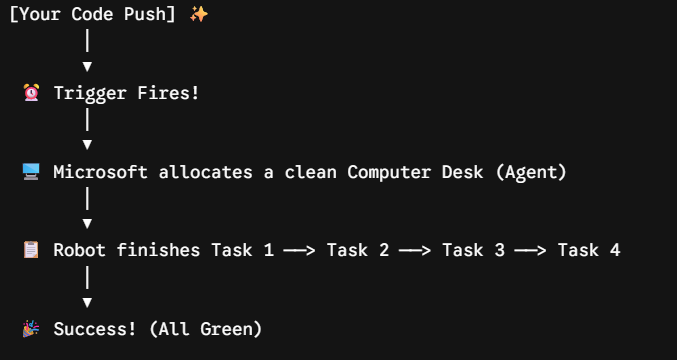
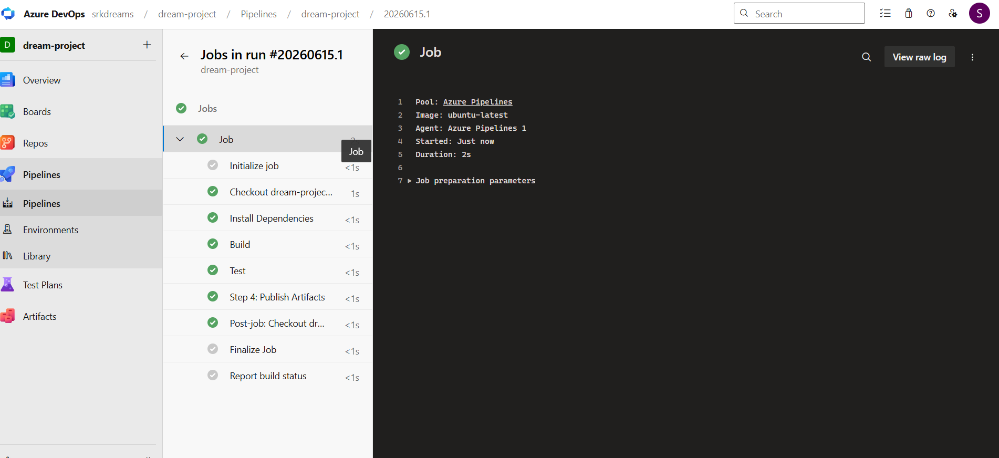

# Azure YAML Pipeline 🚀


---

Welcome! In this chapter, we are going to learn about **Azure Pipelines**. 

Think of a pipeline as a **Magical Robot Helper**. Instead of you doing the boring work of checking, building, and testing your code every day, you write a simple list of instructions, and this robot does it for you automatically!

We write these instructions in a special text file called `azure-pipeline.yml`.

---

## 🤖 The 3 Magic Words of a Pipeline

To talk to our robot helper, we only need to understand 3 simple words used in our code:

1. **`trigger` (The Alarm Clock):** This tells the robot *when* to wake up and start working. For example, "Wake up whenever I push new code to the `main` branch!"

2. **`pool` (The Worker's Desk):** This tells the robot *where* to sit and work. We chose `ubuntu-latest`, which means Microsoft gives our robot a clean Linux computer desk.

3. **`steps` (The To-Do List):** This is the step-by-step list of jobs that the robot must finish.

---

## 📝 Our Robot's To-Do List (`azure-pipeline.yml`)

Here is the exact code we gave to our robot. It reads it from top to bottom:
```yaml
# 1. Wake up when code changes in 'main'
trigger:
- main

# 2. Use a clean Ubuntu computer desk
pool:
  vmImage: 'ubuntu-latest'

# 3. Start doing the tasks one by one
steps:
- script: echo "Step 1: Installing dependencies..."
  displayName: 'Task 1: Install Dependencies'

- script: echo "Step 2: Building the Application..."
  displayName: 'Task 2: Build Code'

- script: echo "Step 3: Running Unit Tests..."
  displayName: 'Task 3: Test Code'

- script: echo "Step 4: Publishing final build artifacts..."
  displayName: 'Task 4: Save Output'
  ```

  ---

## 📊 What Happens When We Run the Pipeline?

When you click the **"Run" button**, the robot starts working live on your screen. Here is a simple chart of how it looks:



---

## 🔍 Reading the Robot's Report Card (Logs)

After the robot finishes the job, it shows us a screen with different symbols. Let's understand what they mean:



---

### 1. The Bright Green Ticks (✅)

**What it means**: The task is 100% successfully completed!

**Our Result**: Our tasks (Install, Build, Test, Save) all got green ticks. This means our instructions were perfect, and the robot had no trouble reading them.

---

### 2. The Quiet Grey Circles (⚪)

**What it means**: This is just background cleanup.

**Our Result**: Steps like `Initialize job` or `Finalize` , `Report build status Job` look grey. `Do not worry, this is NOT an error!` It just means the robot is cleaning its desk, throwing away rough papers, and shutting down the computer safely after finishing your work.

---

## 🎯 What Did We Actually Make Today?

`💡 Fun Fact`: Because we used echo commands, the robot did not build a real video game or app file today. It was a `Practice Run (Simulation)!`

**Why did we do this?**

* We proved that our Magical Robot can connect to our project successfully.

* We created a perfect `skeleton (dhaancha)`. Next time, we will just replace the text messages with real app code, and the robot will automatically build real software for us!

---

## 🚀 How to Create YAML Pipeline (Step-by-Step)

### 🔹 Step 1: Go to Pipelines

* Open Azure DevOps
* Click Pipelines

---

### 🔹 Step 2: Create Pipeline

* Click New Pipeline

---

### 🔹 Step 3: Select Repository

* Choose Azure Repos Git
* Select your repo

---

### 🔹 Step 4: Configure YAML

* Select Existing YAML file
*Choose*:
`azure-pipeline.yml`

---

### 🔹 Step 5: Run Pipeline

* Click Run

**👉 Pipeline will execute automatically**

---

### 🌍 Real-World Example

**Project: Web App**

`👉 Developer pushes code`

`👉 YAML pipeline`:

* Builds app
* Runs tests
* Deploys

**👉 Everything automated 🚀**

---

## 💡 Best Practices

* ✔ Use YAML instead of UI
* ✔ Keep pipelines modular
* ✔ Use variables
* ✔ Use stages
* ✔ Version control pipelines

---

## 🎯 Interview Questions

---

### ❓ What is YAML pipeline?

`👉 CI/CD defined as code`

---

### ❓ Difference between Classic & YAML?

* Classic → UI based
* YAML → Code based

---

### ❓ What is trigger?

`👉 Defines when pipeline runs`

---

### ❓ What are stages?

`👉 Logical pipeline phases`

---

### ❓ Why YAML is preferred?

`👉 Version controlled + reusable`

---

## 💥 Final Understanding
```bash
Repos → Code
CI → Build & Test
YAML → Define pipeline as code
CD → Deploy
```