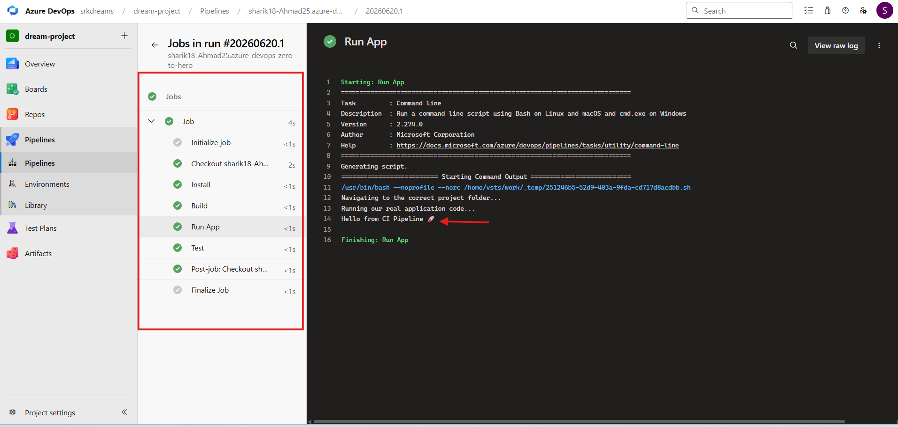

# 🚀 Project 01: Basic CI Pipeline (Beginner to Real DevOps)


---

## 👋 Welcome Students!

In this project, we will learn:

👉 **How a real CI (Continuous Integration) pipeline works in the industry**

We are not just learning theory —
👉 we will build a real working project 💻

---

# 🧠 First Understand the Goal

Imagine:

👉 You created an application
👉 Now you want:

* Code should run automatically
* Errors should be detected quickly
* Everything should be automated

👉 This is exactly what a **CI Pipeline** does

---

# 📂 Step 1: Project Structure (Foundation)

First, we created this project structure:

```bash
project-01-basic-ci-pipeline/
├── azure-pipeline.yml
├── sample-app/
│   └── app.js
└── README.md
```

### 🧠 Why is structure important?

👉 In real projects, everything is organized
👉 Pipeline needs to know where your code is

---

# 💻 Step 2: Application Code (app.js)

File: `sample-app/app.js`

```js
console.log("Hello from CI Pipeline 🚀");
```

### 🧠 What does this do?

👉 When pipeline runs:

* Node.js executes this file
* Output is shown in logs

**👉 Output:**

```bash
Hello from CI Pipeline 🚀
```

---

# ⚙️ Step 3: Pipeline Code (azure-pipeline.yml)

```yaml
trigger:
- main

pool:
  vmImage: 'ubuntu-latest'

steps:
- script: echo "Installing dependencies..."
  displayName: Install

- script: echo "Building application..."
  displayName: Build

- script: |
    echo "Navigating to project folder..."
    cd project-01-basic-ci-pipeline

    echo "Running application..."
    node sample-app/app.js
  displayName: Run App

- script: echo "Running tests..."
  displayName: Test
```

---

## 🧠 Teacher Explanation (Important)

### 1️⃣ trigger

👉 Pipeline runs automatically when code is pushed to `main` branch

---

### 2️⃣ pool

👉 Azure gives a virtual machine (Ubuntu)

👉 Means:

> Code runs in cloud, not on your local system

---

### 3️⃣ steps

👉 These are the actual tasks:

* Install → dummy step
* Build → dummy step
* Run App → real execution 🔥
* Test → dummy step

---

# 🚀 Step 4: Push Code to GitHub (Very Important)

```bash
git add .
git commit -m "feat: added basic CI pipeline project"
git push
```

---

## 🧠 Common Question

### ❓ Why did we push code to GitHub?

👉 Good question 👏

---

## 💡 Answer

### 👉 Real Industry Flow:

```
Developer → GitHub → CI Pipeline → Deployment
```

👉 That means:

* Developer pushes code to GitHub
* Pipeline takes code from GitHub
* Automation starts

---

## ❓ Why not use Azure Portal directly?

👉 It is possible ❗ but not recommended ❌

### ❌ Problems:

* No version control
* Difficult for team collaboration
* Not real-world practice

---

## ✅ Why GitHub is used?

✔ Version control
✔ Easy collaboration
✔ Industry standard
✔ Easy integration with pipelines

👉 That’s why we used **GitHub (Real DevOps approach)**

---

# 🌐 Step 5: Create Pipeline in Azure DevOps

1. Go to Pipelines
2. Click New Pipeline
3. Select GitHub
4. Select your repository
5. Choose YAML file
6. Click Save & Run

---

# 📊 Step 6: Check Output (Most Important)

👉 After pipeline runs:

* Open pipeline run
* Open Job
* Click **Run App step**

👉 You will see:

```
Hello from CI Pipeline 🚀
```

---

# 📸 Pipeline Output (Proof - Logs View)

👉 Below is the successful pipeline execution:



---

# 🧠 Final Understanding

```bash
Write Code → Push to GitHub → Pipeline Trigger → Run App → Output
```

---

# 🎯 What You Learned

✔ CI pipeline basics
✔ GitHub integration
✔ YAML pipeline
✔ How to check logs
✔ Real DevOps workflow

---

# 🏆 Interview Line

👉
"I implemented a CI pipeline using Azure DevOps integrated with GitHub to automatically execute application code and verify pipeline output."

---

# 🎯 Interview Questions & Answers (Must Know)

---

### ❓ What is Continuous Integration (CI)?

👉 Continuous Integration is a process where developers frequently push code to a repository, and the system automatically builds and tests it.

---

### ❓ What is the role of Azure Pipelines in CI?

👉 Azure Pipelines automates the build and test process whenever code is pushed.

---

### ❓ What is a pipeline?

👉 A pipeline is a sequence of steps (like build, test, run) that are executed automatically.

---

### ❓ What is a trigger in pipeline?

👉 Trigger defines when the pipeline should run (e.g., on code push to main branch).

---

### ❓ What is a YAML pipeline?

👉 A YAML pipeline is a pipeline defined using code (`.yml file`) instead of UI.

---

### ❓ Why do we use GitHub with Azure DevOps?

👉 Because:

* It provides version control
* Supports team collaboration
* Follows real industry workflow

---

### ❓ What is the difference between CI and CD?

👉
CI → Build & Test
CD → Deployment

---

### ❓ What is the output of this project?

👉 The pipeline runs the Node.js app and prints:

`Hello from CI Pipeline 🚀`

---

### ❓ Where can you see pipeline output?

👉 In Azure DevOps → Pipeline Run → Logs section (Run App step)

---

### ❓ Why is CI important?

👉

* Detects bugs early
* Automates workflow
* Improves code quality
* Saves time

---

# 💥 Pro Tip for Interviews

👉 Always explain with flow:

`Code → GitHub → Pipeline → Build → Run → Output`

---

# 🚀 Final Advice

👉 Always follow:

```bash
Code → GitHub → Pipeline → Automation
```

👉 This is **real DevOps 🔥**

---

## ❤️ Keep Learning

👉 Next:

* Web App Deployment
* Multi-stage pipelines
* Production-level setups

---