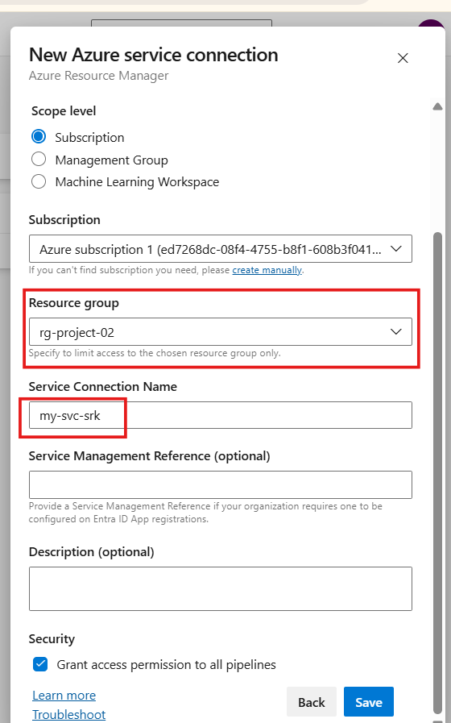
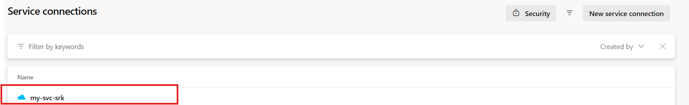
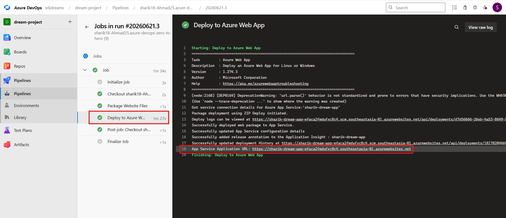
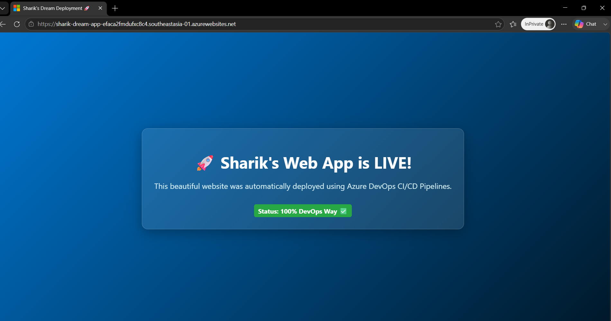

# 🚀 Project 02: Web App Deployment using Azure DevOps (CI/CD)


---

## 👋 Welcome Students!

In this project, we will learn:

`👉 How to deploy a real web application on cloud using CI/CD`

This is not just theory —
👉 we are building a `LIVE website using Azure DevOps 🚀`

---

## 🧠 First Understand the Goal

In previous project:

`Code → Run → Logs`

👉 But now:

**Code → Build → Deploy → LIVE Website 🌍**

---

## 📂 Step 1: Project Structure

First, we created this structure in VS Code:
```bash
04-projects/project-02-webapp-deployment/
├── app/
│   └── index.html
├── azure-pipeline.yml
└── README.md
```

### 🧠 Why structure is important?

* 👉 Pipeline needs to know where your application code is
* 👉 Clean structure = easy deployment

---

## 💻 Step 2: Application Code (index.html)

`Open VS Code > app > index.html`

👉 This is our simple website.

**🧠 What will happen?**

👉 After deployment:

* This page will open in browser
* This is our LIVE proof

---


## ☁️ Step 3: Azure Web App (App Service)

**❓ Why did we create App Service?**

👉 Good question 👏

`👉 App Service is a cloud server where our application runs.`

**💡 Simple Understanding:**

* Local System ❌
* Cloud Server (App Service) ✅

👉 Without server → `app cannot go live`
👉 App Service = `place where website is hosted`

---

## 🛠️ What we did in Azure Portal

Created Resource Group → `rg-project-02`

Created Web App → `sharik-dream-app`

---

### 🛠️ Steps (Azure Portal)
```bash
Go to Azure Portal
Search → App Services
Click Create → Web App

Fill details:

Resource Group → rg-project-02
App Name → your-unique-name
Publish → Code
Runtime → .NET / PHP
OS → Linux
Pricing → Free / Basic

👉 Click Create
```

### 📸 Screenshot Placement


---

## 🔐 Step 4: Service Connection (Important 🔥)

**❓ Why Service Connection?**

👉 Azure DevOps and Azure Portal are `two different systems`

**👉 They cannot talk directly ❌**

👉 So we create:

`Service Connection = Bridge between DevOps & Azure`

### 🛠️ Steps  Open (Azure DevOps Portal)
```bash
Go to Project Settings ⚙️
Click Service Connections
Click Create Service Connection
Select Azure Resource Manager
Select Service Principal (Automatic)

Fill form:

Scope → Subscription
Resource Group → rg-project-02
Name → my-svc-srk
✅ Tick: Grant access to all pipelines

👉 Click Save
```
### 📸 Screenshot Placement

👉 After this section, add:

**🔹 Service Connection Form**




**🔹 Service Connection Created**



---

## 💡 Simple Flow

`Azure DevOps → (Service Connection) → Azure App Service`

* 👉 Without this → deployment will fail ❌
* 👉 With this → pipeline can deploy app ✅

---

## ⚙️ Step 5: Pipeline Code (azure-pipeline.yml)

👉 This is our automation robot 🤖

**🧠 What it does:**

* 1️⃣ Takes website files
* 2️⃣ Creates ZIP package
* 3️⃣ Deploys to Azure Web App

---

## 🚀 Step 6: Push Code to GitHub
```bash
git add .
git commit -m "feat: added web app deployment project"
git push
```

---

## ❓ Why GitHub?

👉 Industry flow:

`Developer → GitHub → Pipeline → Deployment`

👉 Benefits:

* ✔ Version control
* ✔ Team collaboration
* ✔ Real DevOps workflow

---

## 🤖 Step 7: Create Pipeline in Azure DevOps

* Go to Pipelines
* Click New Pipeline
* Select GitHub
* Select repo
* Choose YAML file
* Click Run

---

## 📦 What Happens Internally?

`Code → ZIP → Deploy → Azure → Live Website`

---

## Step 8 🌐 How to Access Your Live Website

Once your pipeline turns green (✅), you can open your website using two simple methods:

### Method 1: Using Azure DevOps Logs

* Open your successful pipeline page in Azure DevOps.

* Click on the Deploy to Azure Web App task.

* Scroll to the bottom of the logs, find App Service Application URL, and click the link.

### Screenshot 



---

### Method 2: Using the Azure Portal

* Log into the Azure Portal.

* Go to App Services and click on your app name (sharik-dream-app).

* Inside the Overview section, look at the right side and click the Default domain link.

### Screenshot 



---

## 🧠 Final Understanding

`Code → GitHub → Pipeline → Deploy → Live Website`

---

## 🎯 What You Learned

* ✔ Azure App Service
* ✔ Service Connection
* ✔ CI/CD Deployment
* ✔ Real cloud workflow

---


### 🏆 Interview Line


`👉 "I deployed a static website on Azure App Service using Azure DevOps CI/CD pipeline integrated with GitHub."`

---
