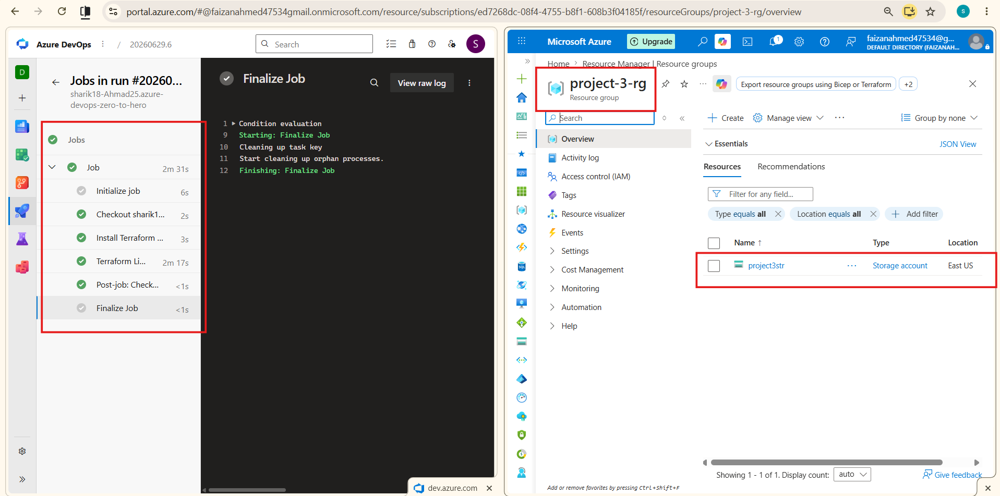

# Automated Azure Infrastructure Deployment via Terraform & Azure DevOps


---

## Overview

This project demonstrates a production-grade CI/CD pipeline using **Azure DevOps Pipelines** to automatically provision and manage infrastructure on **Microsoft Azure** using **Terraform**. 

The pipeline uses native Azure CLI tasks to maintain a highly adaptable and seamless deployment workflow without forcing rigid remote backend constraints during early-stage development.

---

## 📂 Repository Directory Structure
```bash
📂 04-Projects/
└── 📂 project-03-terraform-azure-deployment/
    ├── 📂 Terraform/
    │   ├── 📄 providers.tf      # Configures the AzureRM provider & Terraform version
    │   ├── 📄 variables.tf      # Centralized variables for clean, reusable code
    │   └── 📄 main.tf           # Blueprint defining target Azure Cloud resources
    ├── ⚙️ azure-pipeline.yml     # CI/CD automation manual for Azure DevOps runner
    └── 📝 README.md             # Project documentation and setup guide
```    
---

## 🛠️ Infrastructure Configuration Code (Code Components)

**Step 1: Terraform/providers.tf**

Configures the required provider plugins and versions needed to safely communicate with the Microsoft Azure Cloud API.
```bash
terraform {
  required_providers {
    azurerm = {
      source  = "hashicorp/azurerm"
      version = "~> 4.0"
    }
  }
}

provider "azurerm" {
  features {}
}
```

---

**Step 2: Terraform/variables.tf**

Acts as a remote control for your infrastructure, allowing modifications to resource names, locations, and settings without editing the core infrastructure logic.
```bash
variable "resource_group_name" {
  type    = string
  default = "project-3-rg"
}

variable "location" {
  type    = string
  default = "East US"
}

variable "storage_account_name" {
  type    = string
  default = "project3str"
}
```

---

### Step 3: Terraform/main.tf

Defines the declaration of the actual physical resources.
```bash
# Resource 1: The Parent Logical Container
resource "azurerm_resource_group" "project_lab" {
    name = var.rg_name
    location = var.location
  
}

# Resource 2: The Storage Block (Uses BOTH Dependencies)
resource "azurerm_storage_account" "storage_lab" {
    name = var.storage_account
    resource_group_name = azurerm_resource_group.project_lab.name   # <-- Implicit Dependency
    location = azurerm_resource_group.project_lab.location          # <-- Implicit Dependency 
    account_tier = "Standard"
    account_replication_type = "LRS"

    depends_on = [ azurerm_resource_group.project_lab ]             # <-- Explicit Dependency
  
}
```

---

## 🧠 Why are both resources here and how do they depend on each other?

his file provisions two fundamental building blocks: an `Azure Resource Group` (the logical house) and an `Azure Storage Account` (the locker inside that house).

To ensure the locker is never built before the house is ready, we use `both types of dependencies in Terraform:`


### 1. Implicit Dependency (Automatic Connection)

We pass the Resource Group's name directly into the storage account configuration using:
`resource_group_name = azurerm_resource_group.rg.name`

**How it works**: Terraform is smart. It reads this attribute link and automatically figures out, `"Oh, I cannot fill the group name until the Resource Group itself is created first!"`

### 2. Explicit Dependency (Strict Enforcement)

To leave absolutely zero room for errors, we also explicitly lock the order using the depends_on block inside the storage account:
`depends_on = [ azurerm_resource_group.rg ]`

**How it works:** This is a direct command from the engineer telling Terraform's graph engine, `"Do not even touch or plan the Storage Account until the Resource Group deployment returns a 100% success status."`

---

## ⚙️ CI/CD Pipeline Configuration

### Step 4: azure-pipeline.yml

Instead of using rigid community marketplace tasks that demand pre-existing remote backends, this pipeline leverages the AzureCLI@2 core task. It securely logs into Azure using your designated Service Connection and executes native Terraform binaries sequentially.
```bash
trigger:
- main

pool:
  vmImage: 'ubuntu-latest'

variables:
  azureServiceConnection: 'my-fresh-azure-conn' # Ensure this matches your Service Connection name

steps:
# Task 1: Fetch and install the latest stable Terraform binary onto the host agent
- task: TerraformInstaller@1
  displayName: 'Install Terraform CLI'
  inputs:
    terraformVersion: 'latest'

# Task 2: Execute safe, native terminal operations inside an authorized Azure shell
- task: AzureCLI@2
  displayName: 'Terraform Lifecycle (Init, Plan, Apply)'
  inputs:
    azureSubscription: '$(azureServiceConnection)'
    scriptType: 'bash'
    scriptLocation: 'inlineScript'
    inlineScript: |
      cd $(Build.SourcesDirectory)/04-Projects/project-03-terraform-azure-deployment/Terraform
      
      echo "=== STEP 1: TERRAFORM INIT ==="
      terraform init
      
      echo "=== STEP 2: TERRAFORM PLAN ==="
      terraform plan
      
      echo "=== STEP 3: TERRAFORM APPLY ==="
      terraform apply -auto-approve
```

---

## 🚀 Execution & Deployment Guide

### Step 5: Push Code to GitHub

`Commit your verified configuration files and push them up to your remote code repository:`
```bash
git add .
git commit -m "feat: completed automated terraform deployment pipeline"
git push origin main
```

---

## Step 6: Setup and Trigger the Pipeline in Azure DevOps

**1.  Create a Service Connection:**

* ✅  `Go to Project Settings -> Service Connections -> New Service Connection -> Azure Resource Manager -> Service Principal (automatic).`

* ✅ Set the scope level to `Subscription` and leave the Resource Group dropdown blank `(All resource groups)` so Terraform has permission to create new logical boundaries.

* ✅ Name it `my-fresh-azure-conn`, check the box to `Grant access permission to all pipelines, and save.`

---

**2. Establish the Pipeline:**

* ✅ Navigate to the `Pipelines` tab on the left panel and click `New Pipeline.`

* ✅ Under "Where is your code?", choose `GitHub `and authorize your repo.

* ✅ On the Configure screen, scroll down and select `Existing Azure Pipelines YAML file.`

* ✅ Set the branch to main and map the path explicitly to:

`/04-Projects/project-03-terraform-azure-deployment/azure-pipeline.yml`

`Click Run.`

---

## 🏁 Proof of Success

Once triggered, the build agent acquires a clean execution machine, maps the exact directories, authenticates using the fresh service connection parameters, and runs the infrastructure deployment script.

---

### Screenshot of successfully run Pipeline



---


## 🏆 Final Takeaways

This project demonstrates a complete Infrastructure as Code (IaC) workflow by combining Terraform with Azure DevOps Pipelines to automate Azure resource provisioning.

### Key Skills Demonstrated

* ✅ Infrastructure as Code (Terraform)
* ✅ CI/CD Pipeline Automation using Azure DevOps
* ✅ Azure Resource Provisioning
* ✅ Azure Service Connections & Secure Authentication
* ✅ Terraform Resource Dependencies (Implicit & Explicit)
* ✅ Pipeline-Based Infrastructure Deployment
* ✅ Version Controlled Infrastructure with Git & GitHub
* ✅ Reusable and Modular Terraform Configuration
* ✅ Automated Infrastructure Lifecycle (Init → Plan → Apply)
* ✅ Production-Oriented DevOps Workflow

---