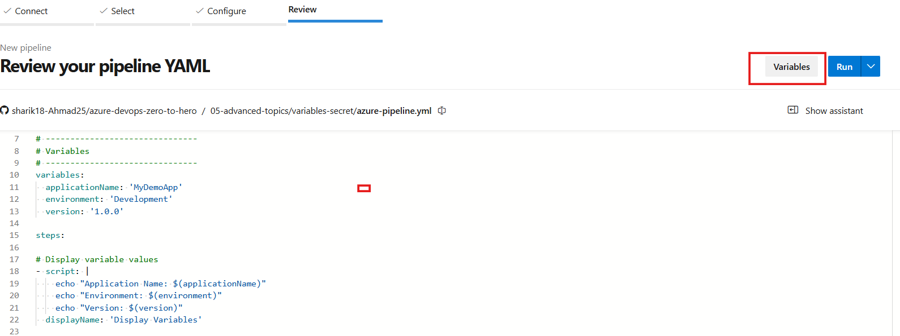
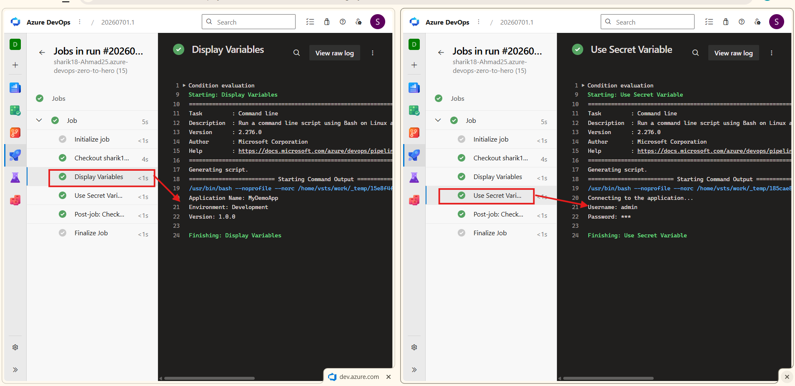

# 🔐 Variables & Secret Variables in Azure DevOps


---

# 👋 Welcome Students!

In this section, we will learn one of the most important concepts used in real DevOps projects.

👉 **Variables and Secret Variables in Azure DevOps**

This topic is used in almost every production pipeline because applications need different values such as:

- Application Name
- Environment
- Database Username
- Passwords
- API Keys
- Connection Strings

Instead of writing these values directly inside the pipeline, we store them as variables.

---

# 🧠 First Understand the Goal

Imagine you have this pipeline:

```yaml
echo "Application Name: MyDemoApp"
echo "Environment: Development"
echo "Password: Admin@123"
```
---

* It works...

* But there is one big problem.

* If tomorrow the application name changes...

* You have to edit the pipeline.

* If tomorrow the environment changes...

* Again edit the pipeline.

* If tomorrow the password changes...

* Again edit the pipeline.

* This is not a good practice

---

## ✅ Better Solution

**Instead of writing values directly...**

`Store them inside variables.`
```yaml
Variable
↓

Store Value
↓

Use Anywhere
```
This makes the pipeline easier to maintain.

---

## 💡 What is a Variable?

A Variable is simply a container that stores a value.

Instead of writing the same value multiple times, we write it once and reuse it everywhere.

**Example:**
```yaml
Application Name
↓
MyDemoApp

Environment
↓
Development

Version
↓
1.0.0
```
---

## 📘 Understanding Variables in YAML

Variables are defined using the variables section.

**Example:**
```yaml
variables:
  appName: 'MyDemoApp'
  environment: 'Development'
  version: '1.0.0'
```
**Here,**
* appName is a variable
* environment is a variable
* version is a variable

---

## 🔍 How to Identify Variables?

**Whenever you see this:**
```yaml
variables:
```
* it means the pipeline variables are being declared.

* This is where Azure DevOps stores reusable values.

---

## 🧠 Variable Syntax

`Variables are used with this syntax:`
```yaml
$(variableName)
```
**Example:**
```yaml
echo "Application Name: $(appName)"
```
**Azure DevOps automatically replaces**
```yaml
$(appName)
```

**with**
```yaml
MyDemoApp
```
before executing the pipeline.

---

## 🎯 Complete Example
```yaml
variables:
  appName: 'MyDemoApp'
  environment: 'Development'

steps:

- script: |
    echo "Application Name: $(appName)"
    echo "Environment: $(environment)"
```
**Output**
```yaml
Application Name: MyDemoApp

Environment: Development
```

---

## 🔐 What is a Secret Variable?

`Now imagine this value:`
```yaml
Password = Admin@123
```
Should everyone be able to see it?

`❌ No.`

Passwords, API Keys and Tokens should always remain private.

Azure DevOps provides `Secret Variables `for this purpose.

---

## 🧠 What is the Difference?

`Normal Variable`

* ✅ Visible in logs

`Secret Variable`

* ❌ Hidden in logs

**Azure automatically masks secret values.**

`Example:`

Instead of showing
```yaml
Password : Admin@123
```
**Azure shows**
```yaml
Password : ***
```
`This protects sensitive information.`

---

## 🛠️ Step-by-Step 

### 🛠️ Step 1: Create a New Pipeline

* Open Azure DevOps Portal.

* Then follow these steps:
```yaml
Pipelines
↓
New Pipeline
↓
Select GitHub
↓
Select your Repository
↓
Choose the YAML file
↓
Click Continue
```

### 🛠️ Step 2: Add Pipeline Variables
Before clicking `Run`, click the `Variables` button.

Now create the variables you want to use in your pipeline.

**Example:**
```bash
| Variable Name | Value       |
| ------------- | ----------- |
| appName       | MyDemoApp   |
| environment   | Development |
```
👉 If your variable contains sensitive information like a password, token, or API key, enable:

**✅ Keep this value secret**

* After adding the variables, click `Save.`

### 📸 Screenshot

👉 Add your Variables screen screenshot here.



---

### 🛠️ Step 3: Run the Pipeline

After saving the variables,

`Click Run.`

Azure DevOps will start the pipeline and automatically use the variables during execution.

### 📸 Screenshot

👉 Add your successful pipeline screenshot here.

 

---

### 🧠 Teacher's Note

Whenever you see this syntax inside a YAML file:
```yaml
$(appName)
```
Azure DevOps automatically replaces it with the value you entered in the Variables window before executing the pipeline.

---

###  What Happens Internally?
```bash
Developer
      │
      ▼
YAML Pipeline Starts
      │
      ▼
Reads Variables
      │
      ▼
Replaces $(variableName)
      │
      ▼
Executes Pipeline
      │
      ▼
Displays Output
```
---

## 🧠 Final Understanding 
```bash
Store Value → Use Variable → Pipeline Executes → Easy Maintenance
```
---

### 🎯 What You Learned

* ✔ What is a Variable

*  ✔ hat is a Secret Variable

* ✔ Difference between Variable & Secret Variable

* ✔ Variables syntax in YAML

* ✔ How Azure DevOps replaces variable values

* ✔ Why Secret Variables are important

* ✔ How to create variables from the Pipeline screen
---


## ❌ Common Beginner Mistakes

* ❌ Hardcoding passwords inside YAML

* ❌ Giving incorrect variable names

* ❌ Forgetting the $() syntax

* ❌ Storing API keys as normal variables

* ❌ Using different variable names in YAML and Pipeline 

---

## 💡 Best Practices

* ✅ Use variables for reusable values

* ✅ Use Secret Variables for passwords and tokens

* ✅ Give meaningful variable names

* ✅ Never hardcode secrets in your pipeline

* ✅ Store sensitive information securely

---

## 🎯 Interview Questions & Answers 

---

### ❓ What is a Variable in Azure DevOps?

👉 A Variable is used to store reusable values that can be accessed anywhere in the pipeline.

---

### ❓ Why do we use Variables?

👉 To avoid hardcoding values and make pipelines easier to maintain.

---

### ❓ What is a Secret Variable?

👉 A Secret Variable stores sensitive information such as passwords, API keys, and tokens. Azure DevOps automatically masks these values in logs.

---

### ❓ What is the difference between Variable and Secret Variable?

**Variable**

* Visible in logs
* Used for normal values

**Secret Variable**

* Hidden in logs
* Used for sensitive information

---

### ❓ How do you use a variable in YAML?
```yaml
$(variableName)
```
**Example:**
```yaml
$(appName)
```
---

### ❓ Where can you create pipeline variables?

👉 Before running the pipeline, click the Variables button and add your variables.

---

### ❓ Why should we avoid hardcoding passwords?

👉 Because anyone with access to the YAML file can see them. Secret Variables help protect sensitive information.

---

### ❓ Can Secret Variables be printed in logs?

👉 No. Azure DevOps automatically masks them as ***.

---

## 🏆 Interview Line

`"I implemented Azure DevOps pipeline variables and secret variables to make the pipeline reusable, secure, and easier to maintain by avoiding hardcoded values."`

---

### 🚀 Final Advice

Always remember this simple rule:
```bash
Normal Information
        ↓
Use Variables

Sensitive Information
        ↓
Use Secret Variables
```

---